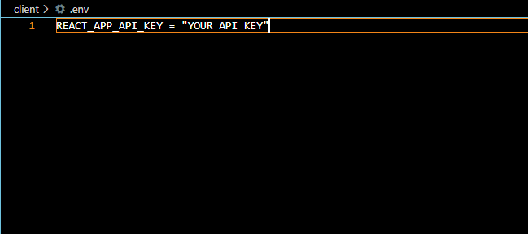
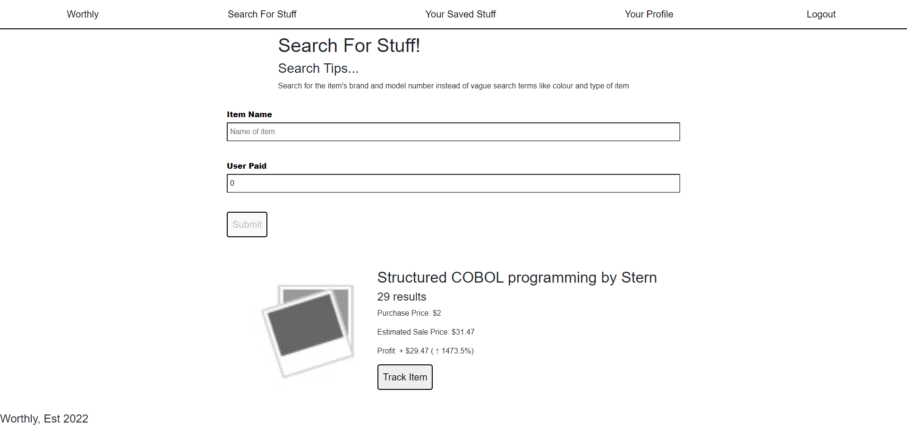
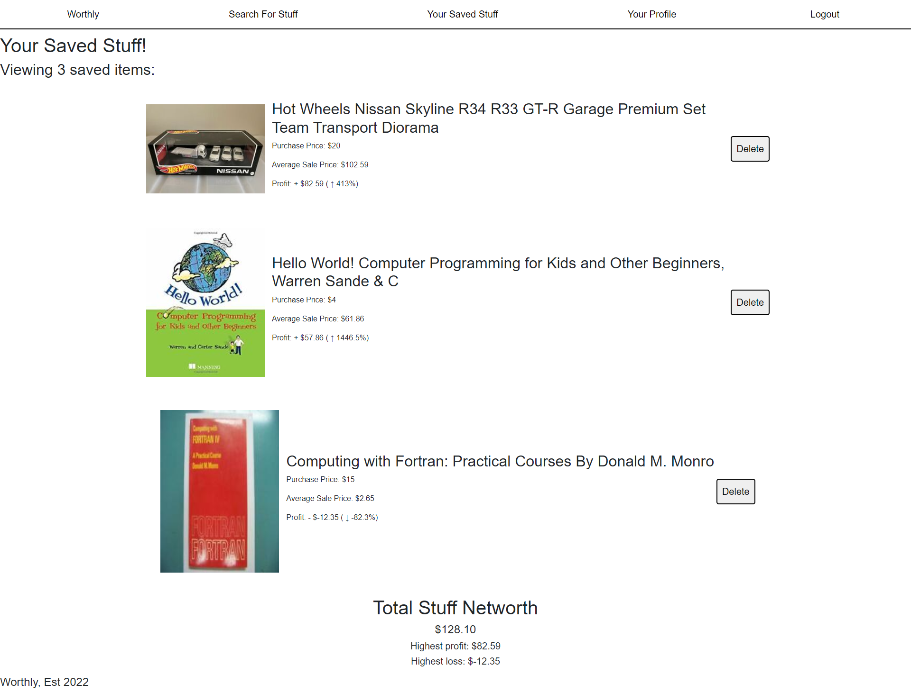

# Worthly

[](https://choosealicense.com/licenses/mit/)
[](https://github.com/HobbaZ/Project-3-Final-Project/commits)
[](https://github.com/HobbaZ/Project-3-Final-Project/branches)
[]()

[](https://img.shields.io/github/issues/HobbaZ/Project-3-Final-Project)


## Description
### Project Aim ###
Keeping track of your interesting and collectable things can be a challenge. What search term did I use? What was the price some months ago? Is the price the real selling price or the seller wanted sale price? In comes Worthly, where you can search for your item and see the highest, lowest and average sale price over a period of time.

### What Problem Does It Solve ###
Collates estimated values of your various items so you can keep track of them and discover your stuff networth.

### What I Learnt ###
How to install polyfills and modify webpack.config for fallback functions, learnt more about React and incorporating styled components

## Deployment
Currently only running on localhost, please clone the git repo to your computer, install dependencies and start the development server to run it on your machine. You will need an API key from (https://serpapi.com/)[https://serpapi.com/] and need to create a .env file inside the client folder with your api key pasted inside it.



If the screen goes completely white, just refresh the page as that is currently a rendering bug that needs to be fixed.

## Table of Contents
- [Description](#description)
- [User Story](#user-story)
- [Screenshots](#screenshots)
- [Installation](#installation)
- [Features](#features)
- [Technology](#technology)
- [Contributors](#contributors)
- [Acknowledgements](#acknowledgements)
- [Testing](#testing)
- [License](#license)
- [Questions](#questions)

## User Story
As a collector of various things

I Want to get an idea of the item’s estimated value and selling rate

So That I can decide whether to sell or keep the items

## Acceptance Criteria
Given a item value reference site

When I first view the site, I can enter the item name and my purchase price

Then I am presented with my profit and profit percentage

When I click Signup

Then I’m presented with the signup page where I can create an account

When I click Login

Then I can login to my account

If logged in, I can search for a item and add it to my saved item’s list, view the saved item’s list, my profile and logout

When I click Saved Stuff

Then I can view my saved item’s and total item networth

When I click Your Profile I can view my profile details

When I click logout

Then I’m returned to the login screen.

## Screenshots

Site homepage


Creating an item


## Installation

1. Clone the repo to your computer by clicking the green code button and copying the SSH version.

2. Open Gitbash in your desired folder and type ```git clone ``` then right click to paste the string and hit enter. The repo will then be cloned to your computer.

3. Navigate to the repo folder and type ```code .``` into gitbash to open the repo in VS Code.

4. Open a new Terminal in VS Code and type ```npm install``` to install the repo dependencies.

5. Finally, type ```npm run develop``` into the terminal and navigate to localhost:3000 in your web browser.

## Features

- Create and track your items

## Technology

- Express
- Heroku (eventually)
- GraphQL
- React
- JWT
- MongoDB
- Crypto
- Serp api Ebay API
- Styled Components

## Contributors
[Zachary Hobba](https://github.com/HobbaZ)

You can also contribute by opening a pull request or submitting an issue.

## Acknowledgements
[https://medium.com/serpapi/how-to-scrape-product-data-from-google-shopping-f1193abd5dc3](https://medium.com/serpapi/how-to-scrape-product-data-from-google-shopping-f1193abd5dc3)

[Polyfills for webpack 5 SerpAPI requirements](https://stackoverflow.com/questions/68707553/uncaught-referenceerror-buffer-is-not-defined)

[https://serpapi.com/ebay-organic-results](https://serpapi.com/ebay-organic-results)

[https://www.amp-what.com/unicode/search/up%20arrow](https://www.amp-what.com/unicode/search/up%20arrow)

[https://styled-components.com/docs/basics#getting-started](https://styled-components.com/docs/basics#getting-started)


## Testing
No tests at the moment

## License
MIT

**Copyright 2022 Zachary Hobba**

Permission is hereby granted, free of charge, to any person obtaining a copy of this software and associated documentation files (the "Software"), to deal in the Software without restriction, including without limitation the rights to use, copy, modify, merge, publish, distribute, sublicense, and/or sell copies of the Software, and to permit persons to whom the Software is furnished to do so, subject to the following conditions:
The above copyright notice and this permission notice shall be included in all copies or substantial portions of the Software.
    
THE SOFTWARE IS PROVIDED "AS IS", WITHOUT WARRANTY OF ANY KIND, EXPRESS OR IMPLIED, INCLUDING BUT NOT LIMITED TO THE WARRANTIES OF MERCHANTABILITY, FITNESS FOR A PARTICULAR PURPOSE AND NONINFRINGEMENT. IN NO EVENT SHALL THE AUTHORS OR COPYRIGHT HOLDERS BE LIABLE FOR ANY CLAIM, DAMAGES OR OTHER LIABILITY, WHETHER IN AN ACTION OF CONTRACT, TORT OR OTHERWISE, ARISING FROM, OUT OF OR IN CONNECTION WITH THE SOFTWARE OR THE USE OR OTHER DEALINGS IN THE SOFTWARE.

## Questions
Find me on Github at [HobbaZ](https://github.com/HobbaZ)
Email me at [zachobba@gmail.com](zachobba@gmail.com)